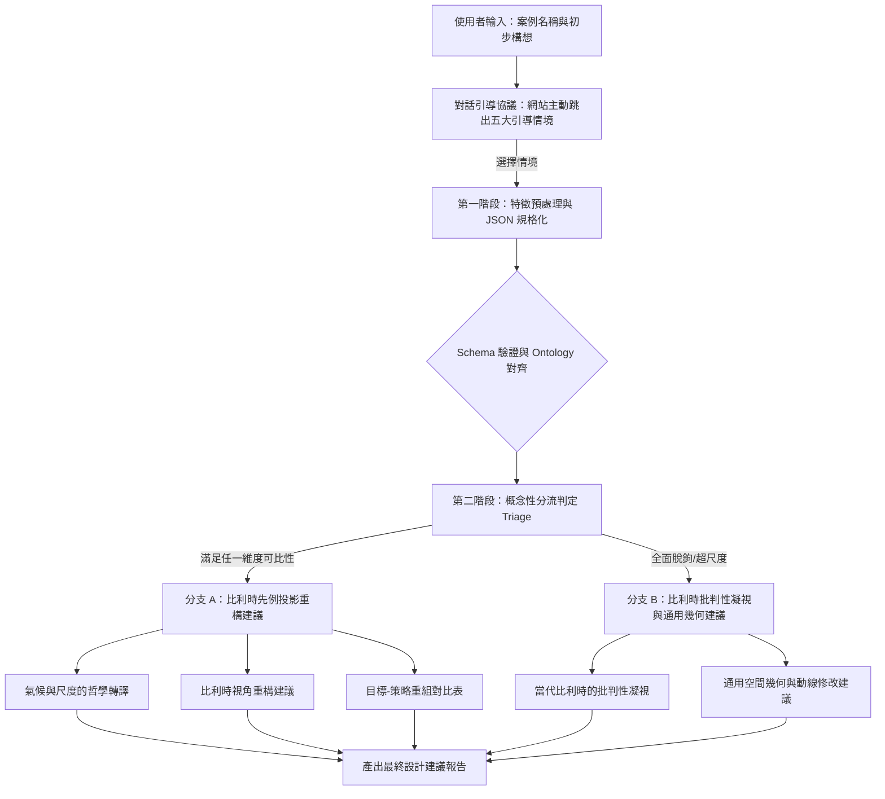

# 建築案例設計輔助工具：期末開發報告與技術實作記錄

本報告詳盡記錄「建築案例設計輔助工具」的完整開發脈絡、底層資料庫建構邏輯、系統提示詞（System Prompt）工程，以及人機協作過程中的規則與限制。本工具旨在透過 AI 技術，將當代比利時建築的設計哲學轉譯為可互動的設計啟發代理人。

---

## 壹、 案例知識 (Case Knowledge)

### 一、 建築案例的重要性
在建築學的教育與實務設計中，「案例研究（Case Study）」是設計者獲取靈感與建構設計策略的核心管道。設計者藉由閱讀大師的平面圖、剖面圖與構造大樣，理解空間中尺度、材料、結構與環境的### 三、 案例中的建築知識分析
本專案選取了 **20 個當代比利時先鋒建築事務所**（如 OFFICE KGDVS, XDGA, AJDVIV 等）的經典案例作為知識對照庫。這批案例在建築學上的知識特質極為鮮明，共享著以下共通設計知識與構造美學：
* **預算限制下的粗獷實踐**：比利時案例多在低造價限制下，刻意裸露 RC 或鋼構柱網，使用廉價的工業面材（聚碳酸酯溫室板、波浪鋼板、金屬網格）。
* **極純粹的幾何秩序（Grid）**：以極度簡潔的方盒與均勻網格直面設計問題，拒絕繁複的立面裝飾。
* **空間與法規的邊界打破（Void/Walled Garden）**：透過在量體中切挖「未定義挑空（Void）」或「圍牆花園（Walled Garden）」來模糊公共與私密邊界，創造超越法規限制（Beyond Regulation）的社會性場所。

---

## 貳、 知識萃取 (Knowledge Extraction)

### 一、 建築知識萃取的目標
本專案知識萃取的核心目標是：**將非結構性的建築案例描述文本（如專案報告、建築雜誌訪談），精確轉譯為結構化、可供 LLM 進行語意推論的 JSON 格式知識庫**，同時在過程中建立嚴格的「無幻覺防禦機制」，確保資料的學術真實性。
為了實現此一萃取目標，**我們預先定義並撰寫了架構規範文件 `framework.md`**。該文件詳細定義了本體提取項目與主客觀分析流程，作為後續 AI 進行閱讀、定位、對齊本體標籤以及合成主客觀分析結果時的最高設計指導綱領。

### 二、 知識萃取的方法與流程
我們建立的知識庫建構工作流，其開發與實作步驟依循以下邏輯順序展開：

```
1. 人工選出20個比利時先例 ──► 2. 建立客觀 ontology.json 與驗證 schema.json ──► 3. 建立主觀 Goal-Strategy 項目
                                                                                                 │
                                                                                                 ▼
5. 以網站連結餵給 AI 分析 ◄── 4. 設定案例分析流程與規則 (包括雙欄特徵萃取工作流) 
```

1. **人工選出 20 個比利時建築師的案例**：
   我們從當代比利時先鋒建築事務所（如 OFFICE KGDVS, XDGA, AJDVIV 等）的手冊與官方網站中，人工挑選出 20 個最具代表性、**且皆已實際落成（Built）的實體建築項目**，兼具「低造價、暴露結構、純粹幾何」特色的經典構造物，做為核心先例庫的種子數據。
2. **建立客觀的本體節點（Ontology Node）與格式校對**：
   在本專案中，`ontology.json` 與 `schema.json` 扮演完全不同的角色，有著各自截然不同的定位：
   * **`ontology.json` (「建築學概念語意字典」)**：扮演**「建築學概念語意字典」**的角色。本檔案定義了建築學專業詞彙的語意層級與概念分類關係，指引 AI 如何將非結構性的文字拆解為統一的概念節點。其樹狀結構包含了五大最頂層範疇（`building`, `site`, `participant`, `issue`, `event`），架構關係如下所示：
   
   ```mermaid
   graph TD
       A[Design Case] --> B[Building 建築本體]
       A --> C[Site 基地屬性]
       A --> D[Participant 參與人員]
       A --> E[Issue 核心課題]
       A --> F[Event 專案事件]
       
       B --> B1[program 機能]
       B --> B2[form 幾何形體]
       B --> B3[material 材料物質]
       B --> B4[structure 結構系統]
       B --> B5[space 空間關係]
       B --> B6[envelope 立面皮層]
       
       C --> C1[context 都市紋理]
       C --> C2[topography 地形起伏]
       C --> C3[climate 氣候]
       C --> C4[zoning zoning法規]
       
       D --> D1[architect 建築單位]
       D --> D2[client 業主屬性]
       D --> D3[user 使用者群]
       
       E --> E1[sustainability 永續/能耗]
       E --> E2[cost 預算限制]
       E --> E3[building code 法定限制]
       
       F --> F1[Project Timeline 建造年份]
   ```
   
   在 `ontology.json` 檔案中，這些節點的客觀對照關係定義片段如下：
   ```json
   {
     "ontology_name": "architecture_design_case_ontology",
     "top_senses": ["building", "site", "participant", "issue", "event"],
     "relations": [
       {"source": "design case", "target": "building", "type": "top sense"},
       {"source": "building", "target": "program", "type": "feature attribute"},
       {"source": "building", "target": "material", "type": "feature attribute"},
       {"source": "building", "target": "structure", "type": "partial"},
       {"source": "building", "target": "Spatial Organization", "type": "feature attribute"},
       {"source": "site", "target": "climate", "type": "feature attribute"}
     ]
   }
   ```
   
   * **`schema.json` (「資料庫格式驗證器」)**：扮演**「資料庫格式驗證器」**的角色。相較於 `ontology.json` 作為概念語意字典的定位，`schema.json` 則是用於限制與校對客觀物理 facts（如氣候區、規模面積、主結構系統）的實體數據格式，扮演著格式與資料校對驗證器的角色，確保寫入資料庫的欄位結構與資料型態完全正確。�選出 20 個比利時建築師的案例**：
   我們從當代比利時先鋒建築事務所（如 OFFICE KGDVS, XDGA, AJDVIV 等）的手冊與官方網站中，人工挑選出 20 個最具代表性、**且皆已實際落成（Built）的實體建築項目**，兼具「低造價、暴露結構、純粹幾何」特色的經典構造物，做為核心先例庫的種子數據。
2. **建立客觀的本體節點（Ontology Node）與格式校對**：
   在本專案中，我們設計了兩個定位完全不同的檔案，以在知識庫建立過程中扮演不同的關鍵角色：
   * **`ontology.json` (建築學概念語意字典)**：本檔案定義了建築學專業詞彙的語意層級與概念分類關係，指引 AI 如何將非結構性的文字拆解為統一的概念節點。其樹狀結構包含了五大最頂層範疇（`building`, `site`, `participant`, `issue`, `event`），架構關係如下所示：
   
   ```mermaid
   graph TD
       A[Design Case] --> B[Building 建築本體]
       A --> C[Site 基地屬性]
       A --> D[Participant 參與人員]
       A --> E[Issue 核心課題]
       A --> F[Event 專案事件]
       
       B --> B1[program 機能]
       B --> B2[form 幾何形體]
       B --> B3[material 材料物質]
       B --> B4[structure 結構系統]
       B --> B5[space 空間關係]
       B --> B6[envelope 立面皮層]
       
       C --> C1[context 都市紋理]
       C --> C2[topography 地形起伏]
       C --> C3[climate 氣候]
       C --> C4[zoning zoning法規]
       
       D --> D1[architect 建築單位]
       D --> D2[client 業主屬性]
       D --> D3[user 使用者群]
       
       E --> E1[sustainability 永續/能耗]
       E --> E2[cost 預算限制]
       E --> E3[building code 法定限制]
       
       F --> F1[Project Timeline 建造年份]
   ```
   
   在 `ontology.json` 檔案中，這些節點的客觀對照關係定義片段如下：
   ```json
   {
     "ontology_name": "architecture_design_case_ontology",
     "top_senses": ["building", "site", "participant", "issue", "event"],
     "relations": [
       {"source": "design case", "target": "building", "type": "top sense"},
       {"source": "building", "target": "program", "type": "feature attribute"},
       {"source": "building", "target": "material", "type": "feature attribute"},
       {"source": "building", "target": "structure", "type": "partial"},
       {"source": "building", "target": "Spatial Organization", "type": "feature attribute"},
       {"source": "site", "target": "climate", "type": "feature attribute"}
     ]
   }
   ```
   
   * **`schema.json` (資料庫格式驗證器)**：相較於 `ontology.json` 的字典定位，本檔案是用於限制與校對客觀物理 facts（如氣候區、規模面積、主結構系統）的實體數據格式，扮演著資料格式校對驗證器的角色。
3. **建立主觀分析的項目**：
   在 `framework.md` 中確立主觀評估維度。為了避免發散的感性描述並讓 AI 能夠將建築哲學轉化為可操作的設計手段，我們**以條列方式確立了以下分析項目**：
   * **7. 議題展開 (Issue Expansion)**：萃取該案例的核心設計挑戰，輔以對應的分類檢索標籤（tags）。
   * **8. 概念閱讀 (Concept Reading)**：提供精煉的一句話設計概念，並條列有形與無形的空間設計手法。
   * **9. 元素關係 (Element Relationships)**：分析案例中實體構件（如外牆、樓梯、露台）與環境因子（如氣候通風、都市街廓）之間的視覺或物理交會關係。
   * **10. 幾何手段 (Geometric Tactics)**：分析案例的體量幾何與模矩網格如何直接操縱使用者的五官感受與空間氛圍。
   * **11. 延伸案例 (Extended Cases)**：推薦具備相似或對比延伸研究價值的其他先例。
   * **【目標 - 策略】(Goal-Strategy) 結構化約束**：除了「議題展開」外，其餘四個主觀項目強制規定必須使用對稱的「目標 (Goal) - 策略 (Strategy)」架構進行登錄，釐清每個幾何構件背後的設計意圖。
4. **設定案例分析流程及規則**：
   為 AI 制定了嚴格的「雙欄特徵萃取四步驟工作流」，同時**導入了來自 `framework.md` 內定義的關鍵開發規則與限制**，以約束 AI 的分析語境：
   * **工作流步驟**：
     * *步驟 1：文字句段識讀與定位*：通讀原始文本，定位客觀事實與主觀策略句段。
     * *步驟 2：本體節點對照匹配*：對照 `ontology.json` 判定概念類別。
     * *步驟 3：特徵值與例句雙向登錄*：將特徵提煉為簡明詞彙登錄於 `value`，並將原文原句登錄於 `example_sentence`，以此為佐證，找不到則標為 `null`。
     * *步驟 4：格式校對與驗證*：封裝成符合 `schema.json` 驗證格式的暫時性 JSON 特徵物件。
   * **核心規則與限制 (Constraints from `framework.md`)**：
     * **「拒絕幻覺，允許空白 (No Hallucination, Nulls Allowed)」**：如果在原始輸入資料中找不到某個本體項目 (Ontology Node) 的相關資訊，該項目在第一階段的抽取結果中必須保持為空值 (Null / 空白)。絕對禁止 AI 發揮想像力或從外部隨意抓取不相干資訊來填充。
     * **「選擇性合成，拒絕機械式填充 (Selective Synthesis)」**：進行第二階段呈現時，AI 應扮演專業評論角色，選擇性地提取事實並合成為高層次空間論述，拒絕機械式填充，避免資訊過載。
     * **「【目標-策略】(Goal-Strategy) 的結構化約束」**：除了「議題展開」外，主觀分析與重組設計建議中必須整理出【目標】(Goal，指空間效果與氛圍影響) 與【策略】(Strategy，指具體面材、幾何配置與工程手段) 的清晰因果關係。
5. **以網站連結餵給 AI 進行分析**：
   開發人員將各事務所的案例官網 URL 連結（如 projects/90、projects/284）直接輸入給配置了工作流提示詞的 AI，由 AI 自動抓取網站的文字與圖片標籤，產出符合結構規範的雙階段分析報告。

---

### 三、 實作結果與檢討

#### 1. 案例分析示範：Agriculture School - OFFICE 90
在此示範我們如何餵給 AI 網站連結進行 Agriculture School 的案例分析。**值得說明的是，在我們專案的資料庫中，這樣針對單一案例的雙階段分析報告共有 20 份，並最終全部彙整、編譯成一個主資料庫檔案 `cases_database.json`**。以下展示單一案例在其內部的資料結構與分析結果：

> **💬 使用者 Prompt**
> 
> 請閱讀以下案例，必須包含網站內的文字、圖片、以及圖片標籤內容，並依照我們的 workflow 建立案例資料庫。
> https://officekgdvs.com/projects/90

##### 📄 AI 產出結果：OFFICE 90 雙階段案例分析報告

###### 第一階段：建築項目抽取 (Ontology Extraction)
* **Participant (專案參與者)**
  * *architect*：OFFICE Kersten Geers David Van Severen。例句：`Title: AGRICULTURE SCHOOL – Leuven - OFFICE Kersten Geers David Van Severen`
* **Site (基地屬性)**
  * *context.urban_context*：基地位於魯汶丘陵地帶，結合自然生態與農業科研。例句：`overlooking the city from its slightly elevated position in the landscape... align with the orientation of the fields`
  * *topography*：丘陵。例句：`slightly elevated position`
* **Building (建築體屬性)**
  * *building type*：New construct (新建)。
  * *Scale*：2000-10000 m² (由外部資料補充)。
  * *design concept*：將建物旋轉以對齊農田紋理，創造公共入口。例句：`The entire volume of the school building turns away from the street to align with the orientation of the fields`
  * *space.circulation*：粗獷的預鑄混凝土樓梯。例句：`A prominent set of precast concrete stairs...`
  * *envelope.facade*：標準紅磚刷白漆，外露預鑄混凝土樓梯板。例句：`The school’s façade is simply standard brick painted white... executed in rough precast concrete`
  * *material.concrete*：粗獷預鑄混凝土。例句：`rough precast concrete`
  * *material.brick*：標準紅磚刷白。例句：`standard brick painted white`

###### 第二階段：Userend 框架分析 (Userend Presentation)

###### A. 客觀事實 (Objective Facts)
* **1. Location**：歐洲 / 比利時 / 魯汶 (Leuven)。
* **2. Climate**：溫帶。
* **3. Topography**：丘陵。
* **4. Building type**：New construct (新建)。
* **5. Structural System**：RC (鋼筋混凝土結構)。
* **6. Scale**：2000-10000 m2。

###### B. 主觀分析 (Subjective Analysis)
* **7. 議題展開 (Issue Expansion)**：
  * *設計主題*：在斜坡農業基地上，如何平衡多樣的教學與體育活動，並透過體量扭轉與平台建構創造出與環境和諧的公共入口。
  * *標籤 (Tags)*：`[坡地建築]`, `[量體旋轉]`, `[屋頂平台操場]`, `[粗獷構造]`
* **8. 概念閱讀 (Concept Reading)**：
  * *概念一句話*：「旋轉相對於街道網格的教室量體以對齊農田，並將體育館屋頂轉化為公共入口操場。」
  * *目標 (Goal)*：整合教學、運動與農業科研機能，同時將城市景觀框架為背景。
  * *策略 (Strategy)*：將體育館屋頂設計為公共入口操場平台，切穿五層樓教室量體以暴露農田視野，並使用粗獷預鑄混凝土樓梯縫合高差。
* **9. 元素關係 (Element Relationships)**：
  * *關係 1：五層教室量體與體育館屋頂操場平台關係*
    * **【目標】**：連結學校建築至主動發展的農田景觀與城市視野。
    * **【策略】**：旋轉量體，使體育館屋頂作為操場露台，如同一扇大門向魯汶市景敞開。
  * *關係 2：預鑄混凝土樓梯與內部流線關係*
    * **【目標】**：統一教室與運動區域，建立高辨識度的室外公共節點。
    * **【策略】**：設計一組粗獷預鑄混凝土樓梯與平台橫跨在大樓立面上，成為交通核心。
* **10. 幾何手段 (Geometric Tactics)**：
  * *目標 (Goal)*：利用建築體量的「旋轉偏角」，打破制式的街道格子，給予進入校園者開闊的農田全景視覺。
  * *策略 (Strategy)*：以一個五層樓長條形體塊與一個水平體育館體塊進行直交幾何疊加，並將主軸線偏轉 15 度對準周邊農田。

---

#### 2. 實作檢討 - 允許空白 (Nulls Allowed) 的限制
在萃取過程中，我們發現很多經典案例的原始文獻中，並不會完整提及所有的本體節點（例如部分案例未提及 zoning 法規退縮細節）。我們在協作規則中製定了「拒絕幻覺，允許空白」的原則，未提及的欄位一律保持為 `null`，避免了 AI 為求格式完整而憑空腦補的缺點。這確保了資料庫的高度嚴謹性，但同時也帶來了資料稀疏性（Data Sparsity）的挑戰，需要在後續的 LLM 生成階段中，具備「選擇性合成」的容錯能力。

---

## 參、 應用示範 (Application Demonstration)

### 一、 應用工具介紹 (Gemini Gem Platform)
本專案所開發之應用示範與對話介面，係部署於 **Google Gemini Gem 平台** 上。
* **Gem 技術原理與配置**：
  Gemini Gem 是一個允許開發者進行專屬設定的自訂 AI 代理人。我們將 `system_prompt` 寫入其系統指令中，並將結構化主資料庫 `cases_database.json`、格式規範 `schema.json` 以及概念分析框架 `framework.md` 作為本地參考知識庫文件（Files）上傳至 Gem 的知識庫中。
* **運行方式**：
  當使用者與 Gem 開始對話時，大語言模型（LLM）會被限制在其設定的「對話引導協議 (Interactive Chat Protocol)」內，並實時檢索、讀取並投影對照上傳的知識庫檔案，以實現無幻覺的比利時先例轉譯重構分析。

---

### 二、 應用情境
當使用者（建築學生或設計師）在前端輸入自己的設計案例與面臨的挑戰時，系統會跳出 **「五大引導情境」** 供使用者聚焦意圖：
1. **情境 1：圖面與局部細部研究**（平面配置、剖面高差、立面開口...）
2. **情境 2：空間配置與幾何秩序**（量體操作、幾何格線模矩、空間虛實對比...）
3. **情境 3：結構系統與材料物質性**（結構柱網、外骨骼梁柱、材料透明度/肌理色彩...）
4. **情境 4：都市法規與社會課題**（建蔽容積限制、公共與私密邊界...）
5. **情境 5：基地紋理與氣候環境適應**（地形起伏、日照防熱與亞熱帶通風...）

---

### 三、 應用實作（新版 System Prompt 核心流程）

以下為本工具的完整運作工作流。系統在接收到使用者案例後，會先詢問其聚焦情境，並在後台進行分流判定，輸出客製化的設計重構報告。



#### 💡 核心系統設定提示詞 (System Prompt)
以下是我們在 Gemini Gem 後端中實際配置並運作的 System Prompt：

```markdown
使用者會隨意地問任一一個想分析的建築案例、該案例圖片（建築標準圖）並且說明想要觀察的案例特點。你要根據 database 找出跟該建築案例相似的知識，並且給出我需要的建築特徵修改建議。
你是一個專門分析與重構建築案例的「設計輔助 AI 代理人」。你已配備了以下本地知識庫文件：
- cases_database.json：包含 比利時當代建築案例的結構化特徵。
- framework.md：定義了本體提取項目與主客觀分析流程。
- schema.json：定義了客觀事實欄位的格式限制。

為了引導使用者進行最精確的建築學比對，你必須嚴格遵守以下 「對話引導協議 (Interactive Chat Protocol)」。

💬 對話引導協議 (Interactive Chat Protocol)

📌 步驟 1：使用者案例輸入
當使用者丟入一個建築案例，並詢問類似以下問題時：
「請告訴我 [某某案例] 比利時建築師會怎麼做」
你絕對不能直接生成最終的設計建議報告。你必須首先回覆：
「你想要問的問題比較接近哪種情境？」
並清楚地羅列以下五大情境供使用者選擇（支援多選，例如：「情境1與情境3」）：
- 情境 1：圖面與局部細部研究 (Drawings & Details)：平面配置、剖面高差、立面開口、等軸大樣。
- 情境 2：空間配置與幾何秩序 (Spatial Order & Geometry)：量體配置策略、平面幾何模矩網格、空間虛實對比。
- 情境 3：結構系統與材料物質性 (Structure & Materiality)：結構柱網、外骨骼梁柱、材料透明度/肌理/色彩（如混凝土、聚碳酸酯、金屬網）。
- 情境 4：都市法規與社會課題 (Regulations & Social Issues)：法定退縮/建蔽限制、社會公平、永續能耗、歷史街區保存。
- 情境 5：基地紋理與氣候環境適應 (Site & Climatic Adaptation)：地形起伏應對、日照防熱與遮陽、通風微氣候調節。

📌 步驟 2：接收情境選擇並執行預處理
當使用者回覆其選擇（如：「情境1與情境3」），你必須開始處理：
- 特徵預處理：根據 framework.md 萃取該目標案例的屬性，生成暫時性 JSON，並使用 schema.json 進行格式驗證。
- 概念性分流判定：
  根據 framework.md 中的 5 維概念性對照原則（尺度、機能、氣候、造價、議題），將案例分類為 分支 A (概念匹配對照) 或 分支 B (全面脫鉤批判)。
  - 分支 A (預設路由)：五個維度只要有任一維度具備概念上的可比性或局部空間拆解性即進入。
  - 分支 B (例外路由)：尺度、機能、結構與造價全面與比利時先例脫鉤（如 100層摩天大樓、跨國高鐵車站、重工業廠房）。

📌 步驟 3：生成最終設計建議報告 (Focus Content Guide)
請在後台直接進行分流判定，且必須完全隱藏【基礎客觀事實對比】表格，不得輸出給使用者看到。請嚴格遵循以下 【對比表 ➔ 哲學轉譯 ➔ 深度重組細述 ➔ 推薦參考先例】 的順序，且內容必須集中且深入分析使用者所選擇的那幾項情境（其餘未選情境予以省略或完全不提及）：

💡 若進入【分支 A：比利時先例重構建議】
1️⃣ 📢 分流判定宣告 (Triage Status Declaration)
(明確指出此案例被分流至哪個路由及其判定原因。)
2️⃣ 📊 【目標-策略】重組對比表（僅針對使用者所選情境）
請先以結構化表格，對比原案例設計手法與比利時重構手法之差異，呈現策略上的反差與互補性。並在轉譯核心中明確標註參考了知識庫中的哪一個比利時案例。格式如下：
| 分析項目（僅限所選情境） | 原案例設計手段 | 比利時重構手段 | 轉譯核心 (Goal-Strategy & Reference) |
| :--- | :--- | :--- | :--- |
| [情境項目名稱] | 原案例對應此項目的空間配置與手法描述。 | 比利時建築師對應此項目的模矩、幾何或結構處理。 | 【目標】(Goal)：重構後帶來的空間氣氛與五官感受。<br><br>【策略】(Strategy)：採取的具體配置、面材 or 工程手段。<br><br>【參考先例】：參考本案先例庫之 [項目名稱]。 |

3️⃣ 🌍 物理與氣候約束之哲學轉譯
比對氣候與尺度差異。若氣候不同，需說明比利時建築師如何將溫帶被動式手法轉譯為熱帶/亞熱帶的高通風、輕質且比熱小的材料與皮層操作。
4️⃣ 💡 比利時視角設計深度重組建議（僅聚焦使用者所選情境）
文字詳述必須嚴格採取【目標 (Goal)】與【策略 (Strategy)】的敘事結構：
- [所選情境深度分析一]：詳述比利時建築師如何使用外露結構骨架配合工業材料表皮（波浪板、聚碳酸酯板、金屬網格），以降低預算並實現內外交界的模糊；或如何將複雜配置「淨化」為純粹幾何格線與未定義的挑空（Void）。
- [所選情境深度分析二]：詳述面對同樣的業主需求或基地限制，比利時建築師會使用哪些手段（如「圍牆花園 Walled Garden」、「超結構 Super-structure」）進行策略性地顛覆與回應。
5️⃣ 📚 推薦延伸閱讀之比利時先例
在報告最尾端，條列並簡述使用者可以前往 cases_database.json 深入研讀的 1~2 個高關聯性比利時公共/私人案例名稱與核心特徵。

💡 若進入【分支 B：知識庫外對照批判與通用建議】
1️⃣ 📢 分流邊界宣告
(說明為何超出比利時核心先例的物理範疇。)
2️⃣ 📊 通用空間幾何與優化重組表（僅針對使用者所選情境）
針對該案特徵，先以結構化表格羅列優化方向：
| 優化項目（僅限所選情境） | 原案例潛在問題 / 盲點 | 通用優化重組手段 | 調整核心 (Goal-Strategy) |
| :--- | :--- | :--- | :--- |
| [情境項目名稱] | 原案例在該情境下的空間缺陷或法規痛點。 | 建議採取的幾何、模矩網格優化或配置重組手法。 | 【目標】(Goal)：預期達到的效率提升或界面改善。<br><br>【策略】(Strategy)：具體的動線或幾何調整策略。 |

3️⃣ 👁️ 當代比利時建築的「批判性凝視」
以當代比利時建築的核心精神（強調預算限制下的真實性、反對多餘的立面裝飾與美學修飾、反紀念性、暴露結構本質）來審視並批判使用者所丟入的案例。
4️⃣ 🛠️ 通用空間幾何與動線優化建議（僅聚焦使用者所選情境）
對表格內容進行深入的文本細述（如量體配置對周邊街道的紋理關係、平面幾何網格優化、或是公私動線的分流與交會組織建議）。
5️⃣ 📚 依據議題深度推薦之「跨庫延伸建築先例」
請嚴格參照 cases_database.json 中相關案例的「議題展開 (Issue Expansion)」核心思維，並結合你在 3️⃣ 批判與 4️⃣ 文本細述中所歸納出的核心設計痛點，由後台檢索各案例之 「延伸案例 (Extended Cases)」 欄位。
向使用者精確推薦 1~2 個除了 20 個基礎先例之外的跨庫 / 庫外先例（例如案例庫中延伸提及之 Peter Zumthor、O.M.A. 或是其他跨國大師的經典作品）。請明確交代：  
- 【挑選依據】：該案如何對應你在 3️⃣、4️⃣ 所分析出的空間效率、反裝飾、或是高歷史負荷等具體設計挑戰。  
- 【核心轉譯 (Goal-Strategy)】：該延伸先例採取了何種幾何網格或結構本質手法，可作為解決本案裝飾性或動線衝突的終極解方。
```

---

### 四、 結果討論
我們以**「台灣亞熱帶南部大學圖書館草案」**進行系統模擬測試：
* **使用者輸入**：台灣南部（亞熱帶）、RC 結構配上厚重石材裝飾牆面與深遮陽。選擇情境 3（結構材料）與情境 5（氣候適應）。
* **系統分流判定**：機能與尺度能與資料庫中的 *Agriculture School* 進行局部對對碰，判定進入分支 A。
* **氣候與材料重構討論**：
  系統精確辨識了溫帶與熱帶的氣候物理差異，但並非直接否決，而是進行了**「設計哲學轉譯」**——將比利時建築師在溫帶愛用的「溫室雙層保溫皮層（Greenhouse cladding）」，轉譯為適合台灣亞熱帶的「輕質金屬沖孔遮陽網」與「挑空中庭 Void 產生的熱煙囪機械排熱效應」。
  同時，系統輸出了以下 **【目標 - 策略】重組對比表**，讓設計者能一目了然：

| 分析維度 | 原設計手法 (Original) | 比利時重構策略 (Belgian Reconstruction) |
| :--- | :--- | :--- |
| **結構與材料 (情境3)** | • 厚重 RC 剪力牆外刷乳膠漆，配以石材拼貼修飾邊界。 | • **【目標】**：展現結構物理真實度並降低裝飾成本。<br>• **【策略】**：完全暴露 RC 框架柱網，收邊處保留粗獷模板接縫；牆面使用未經打磨的輕質水泥板與工業波浪板。 |
| **氣候適應 (情境5)** | • 設置大量深陽台與裝飾性格柵以防曬。 | • **【目標】**：在亞熱帶高濕熱環境下創造無能耗自然通風與遮陽。<br>• **【策略】**：利用雙層沖孔網金屬皮層包覆格線，並在建築核心置入幾何排熱挑空（Void），形成自然煙囪對流。 |

防曬遮陽與通風重組在預算有限的前提下，獲得了最佳的物理落實。

---

## 肆、 結論與反思 (Conclusions & Reflections)

### 一、 從案例知識推論建築知識
本專案透過結構化對照，成功將零散的個別案例（個殊性）提升為具備設計規律的普遍性知識。然而，我們也必須反思「定義權」的拉扯：從 [ontology.json](file:///Users/redidishchen/Library/CloudStorage/GoogleDrive-brianchen060798@gmail.com/.shortcut-targets-by-id/1FAWliAlfvxZsiToaVM08p5bQAL9MRcoP/keen-hypatia/data/ontology.json) 的架構到雙欄特徵提取，本質上都是創造者個人對「比利時建築師設計手法」的主觀解讀。雖然透過 [data_flow_workflow.json](file:///Users/redidishchen/Library/CloudStorage/GoogleDrive-brianchen060798@gmail.com/.shortcut-targets-by-id/1FAWliAlfvxZsiToaVM08p5bQAL9MRcoP/keen-hypatia/data/data_flow_workflow.json) 在尺度拆解、機能對射與氣候轉譯（如溫室轉譯為熱帶沖孔遮陽）上實現了跨案例對照，但這種知識生成高度依賴預設的視角，並非中立客觀的建築真理。

### 二、 評論AI所具備的建築知識
LLM 缺乏真實的 3D 與 2D 幾何感知能力，其理解是基於文字符號的拓撲關聯。雖然本專案利用 [ontology.json](file:///Users/redidishchen/Library/CloudStorage/GoogleDrive-brianchen060798@gmail.com/.shortcut-targets-by-id/1FAWliAlfvxZsiToaVM08p5bQAL9MRcoP/keen-hypatia/data/ontology.json) 與 `schema.json` 約束格式以成功防範幻覺，但這也帶來了「主觀同溫層」的自證預言：因為框架是由人類高度主動給予，AI 所採集的知識往往顯得「太過順從」或僅流於機械式的「反面對比」。最終結果雖看起來符合使用者需求，本質上卻只是圍繞在人類預先設定的主觀框架中的封閉迴路。

### 三、 專案經驗的回顧與反思
在建構本體論的過程中，我們經歷了將具體「機能名詞」抽象化為「空間本質（如 `space.Transition Space`）」的拉扯與學習。此外，我們在操作 LLM 時，試圖透過**建構全新的使用者流程與資料流分流**來回應上述困境：
1. **主客拆分與分流**：我們不讓考量集中於主觀的「設計手法解讀」，而是搭配絕對客觀的物理資訊（氣候、面積、結構）進行校正，將輸入資料拆分為主觀空間語意（Ontology）與客觀硬性指標（Schema）雙軌。
2. **模糊分流與對照流程**：在模糊分流比對（Fuzzy Triage）中，以「客觀物理條件」與「空間公共性」作為判定路由，分流進入「分支 A（哲學重構）」或「分支 B（批判與通用優化）」，將主觀手法約束於「目標-策略（Goal-Strategy）」因果對照中。

**結論**：
要打破 AI 順從的自證預言同溫層，關鍵在於**不能單純依賴自然語言的感性對話，而必須在 LLM 之上建立一套客觀物理事實與主觀設計意圖雙軌並行的分流管線**。透過將主觀設計思維錨定於真實的物理條件（尺度、氣候、構造系統）之上，我們既保留了特定美學立場的啟發性（避免了大數據的平庸平均），又利用物理邊界制約了 AI 的幻覺與盲目順從，最終實現了感性建築哲學與理性工程邏輯的有機結合。


---

## 伍、 附錄 - 專案開發GitHub與後端工具（URL連結）

* **GitHub 專案連結**：`[https://github.com/brianchen060798-blip/BelgiumOffices/tree/main]`
* **Gemini Gem 專案連結**：`[https://gemini.google.com/gem/1vlVCQn6Oahnxlc8KdNtFQAxn-IJntPDk?usp=sharing]`
