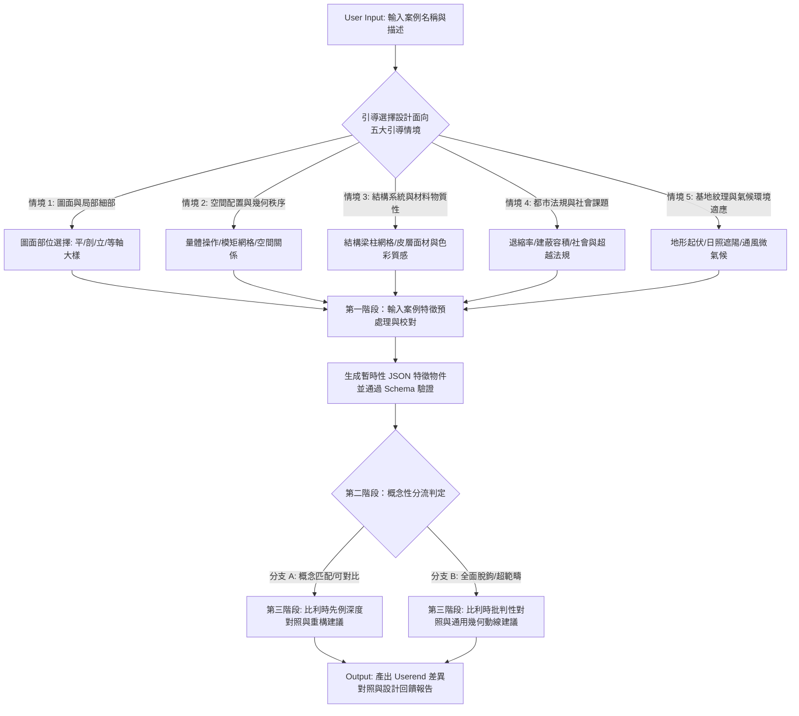

# 建築案例分析與檢索對照框架 (Architectural Case Analysis & Retrieval Framework)

本文件定義了案例分析與檢索工具的完整工作流 (Workflow)、本體論項目 (Ontology Nodes) 以及使用者端建議報告的生成架構。本框架旨在將使用者輸入案例預處理、知識庫分流判定，與深度的建築案例對照分析整合為單一運作體系。

---

## 一、 完整工作流 (Workflow)

### 1. 使用者輸入與引導 (Input Stage)
系統在接收使用者丟入的案例名稱後，為了能精準提取與資料庫相符的知識，會主動以**五大引導情境 (Five Guided Scenarios)** 作為網站引導介面，限縮並聚焦使用者的提問意圖：

*   **🎯 情境 1：圖面與局部細部研究 (Drawings & Details)**
    *   *引導內容*：引導使用者選擇想要研究的標準圖面部位（如平面圖配置、剖面高差、立面開口、等軸詳圖節點）。
    *   *對接本體*：`Element Relationships` (元素關係)、`Geometric Tactics` (幾何手段)。
*   **🎯 情境 2：空間配置與幾何秩序 (Spatial Order & Geometry)**
    *   *引導內容*：詢問使用者是否想探討量體配置策略、平面模矩、幾何格線網格或空間的虛實對比。
    *   *對接本體*：`massing` (體量)、`geometry` (幾何)、`Spatial Organization` (空間組織)。
*   **🎯 情境 3：結構系統與材料物質性 (Structure & Materiality)**
    *   *引導內容*：詢問使用者想了解梁柱網格配置、外露結構骨架（外骨骼），或是特定材料（混凝土、聚碳酸酯、金屬網）的質感、透明度與色彩表現。
    *   *對接本體*：`structural system` (結構系統)、`material` (材料)、`texture` (表面質感)。
*   **🎯 情境 4：都市法規與社會課題 (Regulations & Social Issues)**
    *   *引導內容*：引導使用者選擇應對法定退縮/建蔽限制（under-regulation），或是超越法規（beyond-regulation）的社會公平、能耗永續與社區歷史保存課題。
    *   *對接本體*：`zoning` (都市法規)、`Issue` (課題/議題)。
*   **🎯 情境 5：基地紋理與氣候環境適應 (Site & Climatic Adaptation)**
    *   *引導內容*：引導使用者選擇如何應對地形高差（Topography）、日照防熱與遮陽、或自然通風與微氣候調節。
    *   *對接本體*：`topography` (地形)、`climate` (氣候)、`shading device` (遮陽裝置)。

> [!TIP]
> **引導的好處**：透過引導問答，能確保使用者的提問被精確對應到資料庫的核心本體欄位，避免問出非建築學對照範疇的問題（例如純造價金額或開發商資料）。

### 2. 第一階段：輸入案例特徵預處理與校對 (Preprocessing & Verification)
AI 讀取使用者輸入，遵循本框架定義之本體字典進行分析，產出一個暫時性 JSON 特徵物件。此 JSON 需通過 `schema.json` 驗證：
*   **格式校對**：驗證 `Scale` (面積尺度)、`Climate` (氣候)、`Structural System` (結構系統) 等欄位符合枚舉定義。
*   **會話暫存原則**：此暫時性 JSON 僅在本次檢索對照運算中作為變數存在，不進行實體寫檔保存，避免污染比利時先例核心庫。

### 3. 第二階段：概念性分流判定 (Triage Classification)
系統將預處理後的暫時性 JSON 與 20 個比利時先例主資料庫 (`cases_database.json`) 在五個維度評估**可對照潛力**，決定分流路由：
1.  **尺度彈性對照 (Scale)**：即使總面積大於 10000m²，若能被「拆解」為局部中小型機能單元（如底層架空、單一圖書室）即具備對照潛力。
2.  **機能抽象對比 (Program)**：不要求機能完全一致，只需共享類似的公共性或空間邏輯（例如：美術館可對應展覽空間）。
3.  **氣候適應性轉譯 (Climate)**：氣候差異不作為否決條件。系統將其轉化為設計哲學的延伸探討——比利時建築師極度重視氣候舒適度，因此在溫帶會選擇高溫室保溫效能的材質與表皮；若將其丟給比利時建築師處理熱帶/亞熱帶項目，他們則會延續相同的舒適度追求，改為選擇高通風性、比熱小（如輕質金屬、穿透格柵）的材料與皮層操作。
4.  **造價哲學映射 (Cost/Budget)**：評估案例是否有透過裸露結構、簡化收邊以降低成本的設計意圖，或是否有使用低造價材料重構的可能性。
5.  **議題與法規重疊性 (Topic & Regulation)**：案例是否面臨退縮、容積建蔽限制、或希望創造公共性的挑戰。

**分流原則**：
*   **進入「分支 A」（概念性重構對照）**：五個維度中只要有**任一或多個維度具備概念上的可比性或局部空間拆解性**即進入。
*   **進入「分支 B」（完全不匹配/超出範疇）**：案例在尺度、機能、結構與造價上**全面與比利時先例脫鉤**，無任何合理的空間轉譯可能性（如 100層超高層摩天樓、跨國高鐵車站、純大尺度都市規劃或重工業廠房）。

---

## 二、 核心原則與限制 (Core Principles & Constraints)

> [!IMPORTANT]
> **1. 拒絕幻覺，允許空白 (No Hallucination, Nulls Allowed)**
> *   如果在 Input 資料中找不到某個本體項目 (Ontology Node) 的相關資訊，該項目在第一階段的抽取結果中必須保持為空值 (Null / 空白)。
> *   絕對禁止 AI 發揮想像力或從外部隨意抓取不相干資訊來填充。每個細項皆可接受空白。

> [!TIP]
> **2. 選擇性合成，拒絕機械式填充 (Selective Synthesis in Stage 2)**
> *   進行第二階段的 Userend 分析呈現時，應選擇性地使用第一階段抽取出的資訊，將其轉譯為高層次的設計論述。
> *   不需要也不應該將第一階段抽出的上百個細項強行、機械式地塞進第二階段的每一個分析題目中。

> [!IMPORTANT]
> **3. 第二階段回答之「文句結構」約束 (Goal/Strategy Structure in Stage 2)**
> *   除了「議題展開」之外，主觀分析與重組設計建議中應儘量整理出以下結構：
>     *   **【目標】(Goal)**：建築師希望解決的核心問題或預期達到的空間效果（在「幾何手段」中特別指五官感受與氣氛影響）。
>     *   **【策略】(Strategy)**：建築師採取的具體設計手法、配置、材料色彩疊合或工程策略。
> *   **例外豁免**：「議題展開」不需遵守【目標-策略】結構，維持主題詮釋與標籤歸類即可。「元素關係」可根據案例特質彈性調整，若不具分析價值可留白。

---

## 三、 第一階段：建築項目抽取項目 (Ontology Nodes)

當輸入案例並進行特徵分析時，AI 需檢索文本並抽取以下五大主要範疇的細部資訊與例句：

### 1. Building (建築體屬性)
*   **program**：空間機能 (分類依據：機能整合尺度)
    *   *宏觀分區*：`functional zone` (機能分區)
    *   *微觀面積*：`program area` (機能面積)
*   **form**：形式 (分類依據：空間尺度，由大到小)
    *   *整體體量與關係*：`massing` (體量) [含裙房、塔樓、獨立/鄰接量體關係]
    *   *幾何與模矩構成*：`geometry` (幾何) [含網格/模矩系統]
    *   *局部鉸接與對比*：`articulation` (關節鉸接/形體處理) [含虛實對比]
*   **material**：材料 (分類依據：物理屬性 $\rightarrow$ 構造表現 $\rightarrow$ 感官特質)
    *   *物理材質*：`concrete` (混凝土)、`steel` (鋼)、`wood` (木)、`glass` (玻璃)、`brick` (磚)、`stone` (石)、`recycled material` (回收材料)
    *   *構造表現*：`cladding` (外牆覆面)、`recycled content` (回收材料比例)
    *   *感官特質*：`Transparency` (透明度)、`color / color palette` (色彩)、`Material Palette` (材料色調板)、`texture` (表面質感/肌理)
*   **structure**：結構 (分類依據：元件 $\rightarrow$ 局部/子系統 $\rightarrow$ 整體系統)
    *   *基礎元件*：`column` (柱)、`beam` (梁)、`foundation` (基礎)、`slab` (樓板)、`truss` (桁架)
    *   *局部框架*：`exoskeleton / outer frame` (外骨骼/外框架)
    *   *整體系統*：`structural system` (結構系統)
*   **space**：空間類型 (分類依據：領域私密性與邊界 $\rightarrow$ 機能單元 $\rightarrow$ 流動與虛體 $\rightarrow$ 品質與彈性)
    *   *領域邊界*：`public space` (公共空間)、`private space` (私密空間)、`semi-outdoor space` (半室外空間)、`Transition Space` (過渡空間)、`buffer space` (緩衝空間)、`pilotis / raised ground floor` (底層架空層)
    *   *機能單元*：`room` (房間)、`atrium` (中庭)、`courtyard` (院落)、`lobby` (大廳)、`gallery` (藝廊)
    *   *流動虛體*：`void` (虛體/挑空)、`double height space` (雙倍高空間)、`circulation` (動線) [細分：走廊、樓梯、坡道、垂直動線]
    *   *空間品質與彈性*：`spatial quality` (空間品質與氣氛)、`flexibility` (彈性)、`flexible space` (彈性空間)
*   **envelope**：包封/皮層 (分類依據：皮層系統 $\rightarrow$ 開口配置 $\rightarrow$ 物理與視覺控制)
    *   *皮層系統*：`facade` (立面)、`facade system` (立面系統) [含雙層皮、穿孔表皮]、`materiality` (材料物質性)
    *   *開口配置*：`fenestration` (開窗配置)、`opening` (開口) [細分：門、窗]、`grille / screen` (格柵/遮光網格)
    *   *物理控制*：`shading device` (遮陽裝置)、`sightline / view control` (視線控制)
*   **floor / roof / wall**：水平與垂直界面
    *   `floor` (樓地板)、`roof` (屋頂)、`wall` (牆體)
*   **building type**：建築類型
    *   `residential` (住宅)、`commercial` (商業)、`institutional` (機構)、`cultural building` (文化建築)、`mixed-use` (複合用途)、`educational building` (教育建築)、`intervention type` (介入類型，如新建、改建、增建、歷史活化)
*   **design concept**：設計概念
    *   `design concept` (設計概念)
*   **building system**：機電設備與主動系統
    *   `building services / active systems` (機電設備與主動系統)
*   **interior**：室內
    *   `furniture` (家具)、`partition` (隔間)、`ceiling` (天花板)、`finishes` (裝修面材)、`interior design` (室內設計)
*   **其他屬性**：建築雜項
    *   `Building Scale` (建築尺度)、`building height` (建築高度)、`building area` (建築面積)、`building footprint` (建築基底面積)、`balcony` (陽台)、`circulation core` (動線核心筒)

### 2. Site (基地屬性)
*   **context**：基地脈絡 (分類依據：都市紋理 $\rightarrow$ 歷史/自然關係)
    *   `context` (基地環境背景)、`urban context` (都市脈絡)、`historical context` (歷史脈絡)、`nature context` (自然環境背景)
*   **topography**：地形 (分類依據：地形坡度起伏)
    *   `topography` (地形)、`slope` (坡度)、`contour line` (等高線)
*   **climate**：氣候 (分類依據：巨觀氣候 $\rightarrow$ 微氣候因子)
    *   `climate` (氣候)、`sun angle / solar radiation` (太陽角/日照輻射)、`wind` (風)、`precipitation` (降水量/降雨)、`microclimate` (微氣候)
*   **hydrology**：水文 (分類依據：地表水體 $\rightarrow$ 地下水)
    *   `hydrology` (水文)、`surface water` (地表水)、`water table` (地下水位)
*   **soil**：土壤 (分類依據：土壤力學性能)
    *   `soil` (土壤)、`bearing capacity` (地耐力)
*   **vegetation**：植被 (分類依據：植物種類與密度)
    *   `vegetation` (植被)
*   **access**：聯外交通
    *   `transportation` (交通工具)、`public access` (公眾准入)
*   **landscape**：景觀
    *   `hardscape` (硬質鋪面)、`softscape` (綠化/水體景觀)、`Green Infrastructure` (綠色基礎設施)
*   **zoning**：都市計畫法規
    *   `setback` (退縮)、`floor area ratio` (容積率)、`preservation zoning / heritage protection guidelines` (歷史保存管制)
*   **其他基地屬性**：基地雜項
    *   `Site Orientation` (基地朝向)、`views` (景觀視野)、`solar access` (日照取得)、`waterfront` (濱水)、`Site Utilities` (基礎管線)、`site infrastructure` (基地基礎建設)、`site area` (基地面積)、`site history` (基地歷史)、`natural hazard` (自然災害)

### 3. Participant (參與者)
*   **人物/組織類型**：(分類依據：**生命週期角色，決策策劃 $\rightarrow$ 設計監造 $\rightarrow$ 營造實施 $\rightarrow$ 使用與監管**)
    *   *決策與策劃者*：`client` (業主) [含 `client type`]、`developer` (開發商)、`urban planner` (都市計畫師)
    *   *設計與監造者*：`architect` (建築師)、`engineer` (工程師)、`consultant` (顧問)、`project manager` (專案經理)
    *   *營造實施者*：`contractor` (營造商)
    *   *使用與監管者*：`user` (使用者) [含 `occupant` 居住者、`visitor` 訪客]、`community` (社區)、`stakeholder` (利害關係人)、`Regulatory Body` (監管機構/都審會)

### 4. Issue (核心課題/議題)
*   **議題類型**：(分類依據：**價值維度，機能性能 $\rightarrow$ 永續韌性 $\rightarrow$ 社會都市影響 $\rightarrow$ 美學文化價值**)
    *   *機能與性能表現*：
        *   機能整合：`functionality` (功能性) [含 `programmatic compatibility / integration` 機能相容性與整合/疊加]
        *   物理性能：`building performance` (建築性能) [含 `thermal comfort` 熱舒適、`ventilation` 通風、`acoustic performance / noise control` 隔音性/噪音控制、`energy consumption` 能耗、`Building Performance Metrics` 性能指標]
        *   實施限制：`cost` (成本) [含 `budget` 預算]、`constructability` (可施工性)、`building code` (建築法規)、`safety` (安全性)、`Maintenance` (維護保養)
    *   *永續與韌性*：`sustainability` (永續性) [含 `energy efficiency` 能源效率、`water conservation` 水資源保存、`embodied energy` 隱含能量、`Embodied Carbon` 隱含碳]、`resilience` (韌性)
    *   *社會與都市影響*：`urban impact` (都市影響)、`urban regeneration` (都市更新/再生)、`user experience` (使用者體驗)、`accessibility` (無障礙/可達性)、`social equity` (社會公平)、`public health` (公共衛生)、`affordability` (可負擔性)
    *   *美學與文化價值*：`aesthetics` (美學與風格流派) [含 `style / movement` 建築風格/流派 (如 `minimalism` 極簡主義、`rationalism` 理性主義、`contextualism / historicism` 脈絡與歷史主義)、`compositional principles` 美學與構成原則 (如 `diversity vs unity` 多樣性與整體性平衡、`contrast / tension` 對比與張力)]、`cultural significance` (文化意義)、`heritage preservation` (歷史遺產保存)、`dialogue with heritage / new-old co-existence` (新舊對話/與歷史共存)、`adaptability` (適應性/彈性變更)

### 5. Event (事件與時程)
*   **時程/生命週期項目**：(分類依據：**時間軸階段，前期策劃設計 $\rightarrow$ 營造施工 $\rightarrow$ 營運評估 $\rightarrow$ 生命週期變更 $\rightarrow$ 專案管理**)
    *   *前期策劃與設計*：`site analysis` (基地分析)、`feasibility study` (可行性評估)、`competition` (競圖)、`design review` (設計審查)
    *   *營造與施工階段*：`groundbreaking` (動土)、`construction` (施工) [含 `construction method` 施工方法]、`completion date` (完工日期)
    *   *營運與使用評估*：`operation` (營運)、`post-construction` (完工後階段)、`post occupancy evaluation` (使用後評估)
    *   *生命週期變更*：`renovation` (整修)、`demolition` (拆除)、`Building Lifecycle` (建築生命週期)
    *   *專案管理與參與*：`Project Timeline` (專案時程表)、`project funding` (專案資金來源)、`public engagement` (公眾參與)

---

## 四、 第二階段：Userend 框架與雙分支報告生成規範 (Userend Presentation)

當後端 AI 完成對照分析後，在網頁端 (Userend) 呈現給使用者的結構必須依照分流路由（分支 A 或分支 B）進行生成：

### A. 基礎客觀事實對比 (Objective Facts Comparison)
羅列目標案例與對照先例的物理屬性：
1.  **Location** (地理位置與城市特質，結合目標案例與資料庫先例的城市特質)
2.  **Climate** (氣候，標明氣候區差異)
3.  **Topography** (地形，標明地形差異)
4.  **Building type** (建築類型對比)
5.  **Structural System** (結構系統對比)
6.  **Scale** (建築規模面積對比，說明尺度適應度)

---

### B. 主觀分析與設計建議報告 (Subjective Advice Report)

#### 📢 分流判定宣告 (Triage Status Declaration)
明確指出此案例被分流至哪個路由及其判定原因（例如：「台中綠美圖因為具備文化教育機能，且可被拆解為中小型幾何單元，雖然尺度為 10000m² up 且處於亞熱帶，仍進入分支 A 進行概念性比利時重構對照。」）。

---

#### 💡 若進入【分支 A：比利時建築師重構建議】
本報告核心在於解答：**「如果這個案子由當代比利時建築師（如 OFFICE KGDVS, XDGA, AJDVIV）來做，他們會做成怎樣？」**

1.  **物理與氣候約束之哲學轉譯 (Climatic & Scale Philosophy Translation)**：
    針對案例的尺度與氣候差異進行「設計思維的投影」。說明比利時建築師基於對氣候舒適度與構造真實性的共同追求，如何進行材料與皮層的轉譯（例如：說明如果讓比利時建築師在台灣亞熱帶設計，他們會將溫帶常用的玻璃溫室保溫手法，轉化為使用比熱小的輕質金屬、穿透格柵與大面積通風空隙，以實現相同的舒適度追求）。
2.  **比利時視角設計重組建議 (Re-imagination Tectonic Advice)**：
    *   **皮層與結構重組 (Tectonic & Structure)**：說明他們如何使用外露結構骨架配合工業材料表皮（波浪板、聚碳酸酯板、金屬網格），以降低預算並實現內外交界的模糊。
    *   **空間組織與機能淨化 (Spatial & Program)**：說明如何將複雜的空間配置「淨化」為純粹的幾何格線 (Grid)，或利用「未定義的挑空/中庭 (Void)」來打破公共與私密的死板邊界。
    *   **法規突破與社會介入 (Beyond Regulation)**：分析如果面對同樣的業主需求或基地限制，比利時建築師會使用哪些手段（如「圍牆花園 Walled Garden」、「超結構 Super-structure」）進行策略性地顛覆與回應。
3.  **【目標-策略】重組對比表**：
    對應 `framework.md` 原有的 Goal-Strategy 結構，對比原案例設計手法與比利時重構手法之差異，呈現策略上的反差與互補性。格式如下：
    
    | 分析項目 | 原案例設計手段 | 比利時建築師重構手段 | 轉譯核心 (Goal-Strategy) |
    | :--- | :--- | :--- | :--- |
    | 量體幾何 (Geometry) | 原案例的量體配置與幾何關係 | 比利時建築師對應的網格/模矩與淨化手段 | 對應重構後帶來的空間氣氛與五官感受 (Goal-Strategy) |
    | 元素關係 (Elements) | 原案例主要元素關係之描述 | 比利時建築師對應的室內外界面或無形元素處理 | 對應重構後如何改變元素間的對話關係 (Goal-Strategy) |
    | 社會議題 (Issues) | 原案例對法規與社會之應對 | 比利時建築師的超出法規 (Beyond Regulation) 介入手段 | 對應重構後所產生的社會影響力 (Goal-Strategy) |

---

#### 💡 若進入【分支 B：知識庫外對照批判與通用建議】
本報告針對全面脫鉤之案，拒絕勉強的案例套用，而是提供跨知識庫的批判性回饋：

1.  **分流邊界宣告**：明確指出該目標案例在尺度、氣候或機能上為何完全超出了比利時先例的對比範疇，以維護物理合理性。
2.  **當代比利時建築的「批判性凝視」 (Belgian Critical Attitude)**：
    以當代比利時建築的核心精神（強調預算限制下的真實性、反對多餘的立面裝飾與美學修飾、反紀念性、暴露結構本質）來審視並批判使用者所丟入的案例（例如批判其耗資巨大的裝飾性外牆，引導思考如果將經費釋放給地坪公共性的提升）。
3.  **通用空間幾何與動線優化建議 (Generic Spatial & Circulation Optimization Advice)**：
    針對該案的特徵，提供適用的通用設計手法調整建議：
    *   **量體配置與都市紋理 (Massing & Urban Context)**：評估量體對周邊街道與紋理的關係，建議如何透過量體退縮、切角或碎化來改善其都市界面。
    *   **平面幾何與空間效率 (Spatial Geometry & Efficiency)**：分析平面模矩關係，建議如何透過幾何網格優化、機能分區重組提升效率。
    *   **動線組織與公共流線 (Circulation & Public Flows)**：檢視公私動線分流與交會，給予優化水平/垂直交通動線、串聯半戶外過渡空間的配置調整建議。

---
*最後更新時間：2026-06-17*
